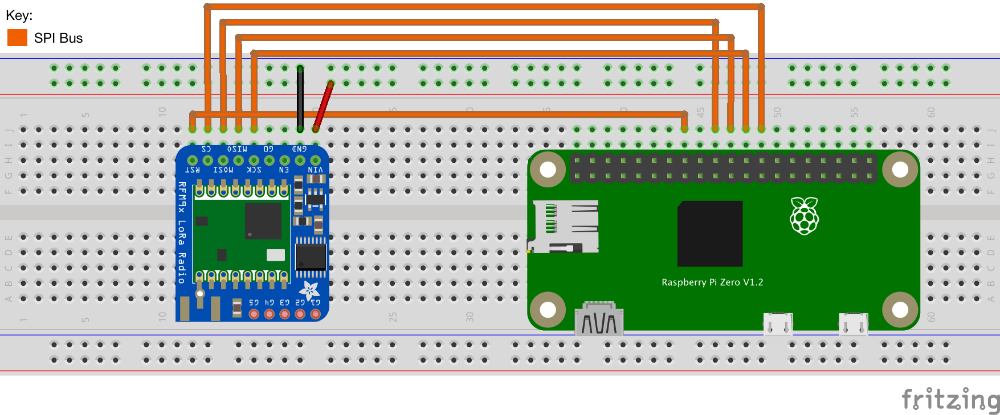
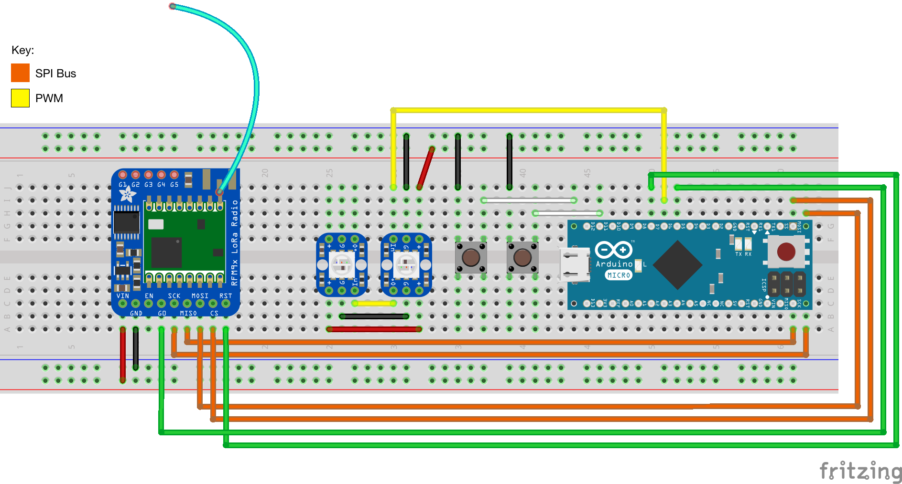

# Stagelight

Proof of concept full-stack application to control LED wristbands that are used
in concert and other event settings. This application is a re-implementation and
evolution upon the following system:

[](https://www.youtube.com/watch?v=iUZtSVhTCTo)

The only functionality this project adds is the ability for people to vote with
their wristbands. This could be used in an eSports event to revive players on a
team or give a team a special perk or vote for player of the game. It also
generally adds two-way communication on the bands allowing for more complex
functionality in the future (should the need to add more comes up).

**Note:** This project will not be maintained. It was created as a proof of
concept project for a course I took in university. If this breaks in the future
then I probably won't fix it. I also won't respond to any support queries on how
to get this working.

## Components
The system is composed of the following components

- [Band](band/): This code is run on the LED wristbands. It uses a couple of
    simple state machines that take data from the packet radios and forwards
    data to them. This component is intentionally simple as it assumes all data
    will be sanitized on the backend.
- [Bridge](bridge/): This code runs on a Raspberry Pi and _bridges_ the
    communication between the backend and the bands. It receives commands and
    data from both systems and sends it to the specified targets.
- [Backend](web/): This is actually two components (elaborated below):
  - [API](web/api/): Written in Go, this component handles all of the band
      coordination. It takes inputs either from HTTP requests or from the web
      interface and stores it in a database. It handles sanitizing input data
      and forwarding the important data to the bridge.
  - [UI](web/stagelight-ui/): Writen using Vue, this web interface takes inputs
      from users and displays information about the bands (color profiles and
      voting results).

## Setup
This setup won't go too in depth on how to set this system up for yourself, but
will give enough information for anyone determined enough to get working.

### Backend
This part will guide you through how to setup the backend. Some of the steps are
less specific than others and will assume that you know how to do them.

#### Required Items
Quantity | Name | Notes
-------- | ---- | -----
1        | A VPS of some sort | I use DigitalOcean and recommend it. Use [my link](https://m.do.co/c/97f84145dfdb) to sign up and get $100 in credit. Note that I do get $25 from this. |
1        | A Domain | Any domain name provider will work. |

#### Steps
1. Create VPS with your prefered provider.
2. Use the IP address to create an `A` record on your domain. This can be
   anything. For example, you owned `example.com` you could use `stagelight.example.com`.
3. Install Docker on the VPS. See [this
   guide](https://docs.docker.com/install/linux/docker-ce/ubuntu/) for how to
   install Docker on your Linux distro of choice.
4. SSH into your VPS and clone this repository. Run the commands below to get
   started.
   ```bash
   $ git clone https://github.com/MrFlynn/stagelight.git && cd stagelight/web/
   $ docker-compose up -d --build
   ```
5. Once the last command finishes, go the domain you setup in step 2. The UI
   should be up.

### Bridge
Like the previous section, these steps will also require some previous
experience in the subject at hand. Specifically, knowing how to wire stuff on a
breadboard and how to solder is required.

#### Required Items
Quantity | Name | Notes
-------- | ---- | -----
1        | [Raspberry Pi Zero W](https://www.adafruit.com/product/3400) | A regular Raspberry Pi will also work. The pinout might be a little different.
1        | [RFM95W LoRa Radio](https://www.adafruit.com/product/3400) | |
1        | [Antenna](https://www.adafruit.com/product/4269) | This one is specifically designed for 915 MHz operation. |
6        | Jumper Wires | |
1        | Breadboard | |

#### Steps
1. Load an OS on the Raspberry Pi. Make sure [SPI is
   enabled](https://www.raspberrypi.org/documentation/hardware/raspberrypi/spi/README.md).
2. Wire up the Raspberry Pi according to the following diagram:

3. SSH into the Pi and run the following commands.
   ```bash
   $ git clone https://github.com/MrFlynn/stagelight.git && cd stagelight/bridge/
   $ sudo apt-get install python3-pip
   $ pip3 install RPI.GPIO adafruit-blinka adafruit-circuitpython-rfm9x
   $ python3 main.py --server=<domain_name_of_backend>
   ```

### Band
This section will require some knowlegde of soldering and breadboard wiring like
the previous section.

#### Required Items
Quantity | Name | Notes
-------- | ---- | -----
1        | [Arduino Micro](https://store.arduino.cc/usa/arduino-micro) | A regular Raspberry Pi will also work. The pinout might be a little different.
1        | [RFM95W LoRa Radio](https://www.adafruit.com/product/3400) | |
2        | [NeoPixels LEDs](https://www.adafruit.com/product/1558) | This is a sheet of 25. You can buy smaller quantities, but if you want to create multiple bands the linked product is recommended. |
1        | [Antenna](https://www.adafruit.com/product/4269) | This one is specifically designed for 915 MHz operation. |
2        | Push buttons | |
18       | Jumper Wires | |
1        | Breadboard | |

#### Steps
1. Wire up the breadboard as shown in the diagram below:

2. Install [Platform.io](https://platformio.org).
3. Clone the repository to your machine and initialize all submodules:
   ```bash
   $ git clone https://github.com/MrFlynn/stagelight.git && cd stagelight/
   $ git submodule update --init --recursive
   ```
4. Connect the Arduino to your computer and build + upload the firmware. This
   can be done either using the Platform.io GUI or by running the following
   command: `platformio run --target upload`.

## Conclusion
Congrats! Assuming everything worked, the band(s) you just created and
programmed should automatically show up in the Web UI.
